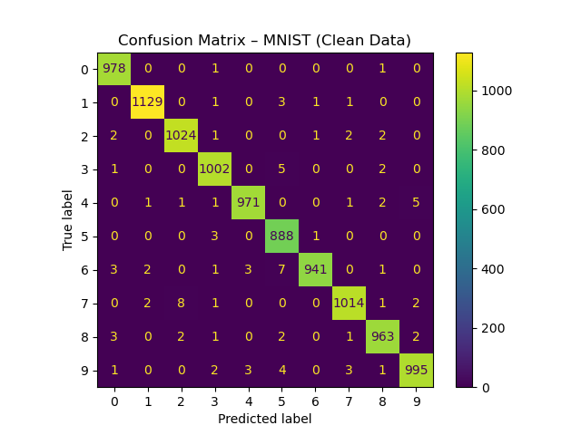

    # Confusion Matrix – Clean Dataset

Below is the confusion matrix of the CNN model tested on the clean MNIST test set.

### 🔍 Observations:
- The model achieved very high accuracy across all digit classes.
- Most digits were correctly classified.
- Minor confusion found between:
  - 4 & 9
  - 3 & 5
- These errors will be compared again **after adversarial attacks and poisoning**.

This serves as the **baseline performance** for comparison in **Red Teaming & Blue Teaming** phases.
