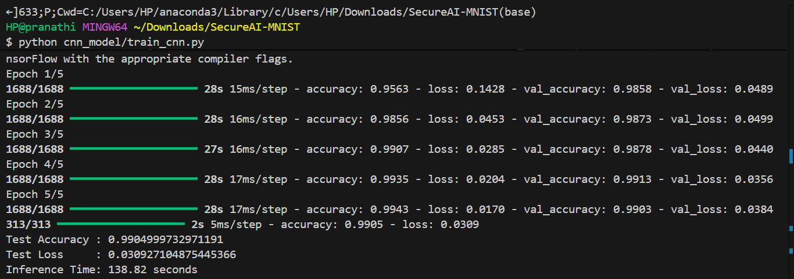

🧪 Performance Results – MNIST CNN (Clean Dataset)
📌 Model Used

CNN Model trained using TensorFlow/Keras

Dataset Format: IDX (original MNIST format)

Model File Saved as: mnist_cnn_idx.h5

🧠 Training Summary
Metric	Value
Total Epochs	5
Training Accuracy (Final)	99.43%
Validation Accuracy (Best)	99.03%
Test Accuracy	99.05%
Test Loss	0.0309
Inference Time	138.82 seconds
📸 Training Output Screenshot

📈 Loss & Accuracy Trend (from terminal)
Epoch 1/5 – accuracy: 0.9563 – loss: 0.1428 – val_accuracy: 0.9858 – val_loss: 0.0489  
Epoch 2/5 – accuracy: 0.9856 – loss: 0.0453 – val_accuracy: 0.9873 – val_loss: 0.0499  
Epoch 3/5 – accuracy: 0.9907 – loss: 0.0285 – val_accuracy: 0.9878 – val_loss: 0.0440  
Epoch 4/5 – accuracy: 0.9935 – loss: 0.0204 – val_accuracy: 0.9913 – val_loss: 0.0356  
Epoch 5/5 – accuracy: 0.9943 – loss: 0.0170 – val_accuracy: 0.9903 – val_loss: 0.0384  
Test Accuracy : 0.9904999732971191  
Test Loss     : 0.030927104875445366  
Inference Time: 138.82 seconds  

📌 Observations

✔ Model achieved very high accuracy (99.05%) on clean MNIST data.
✔ Validation accuracy remained stable → good generalization.
✔ Loss steadily decreased → model learning effectively.
✔ Inference time is high (≈138s) → can be optimized.

🧾 Conclusion

The baseline CNN model performs exceptionally well on clean MNIST data.
This serves as the benchmark for comparison when we:

Introduce poisoned data

Generate adversarial samples (FGSM / PGD)

Retrain model for defense (Blue Teaming)